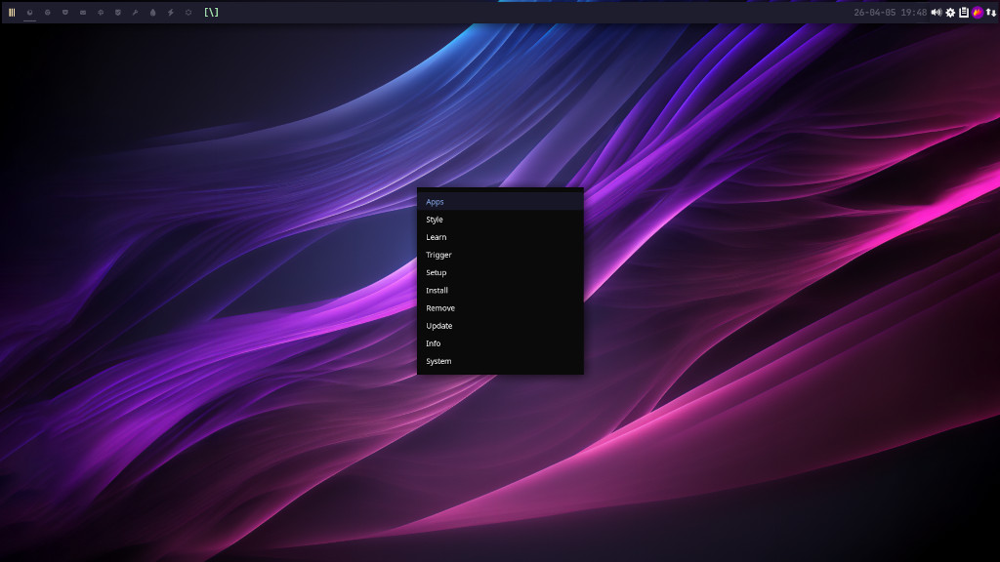
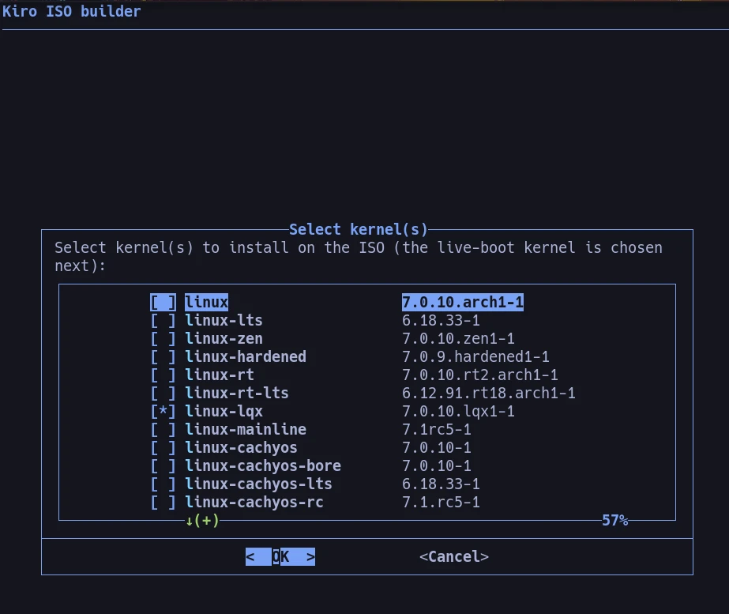
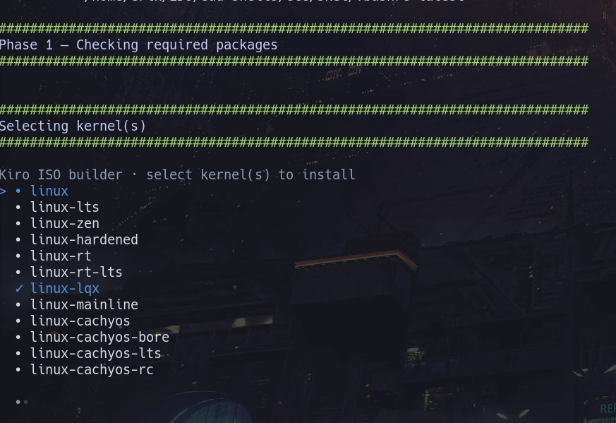

# KIRO ISO

<p align="center">
  
</p>




---

## Overview

**KIRO** is a community Arch-based Linux distribution. This repository is its ISO builder — it uses the official ArchISO toolchain to produce reproducible builds with pre-configured packages, desktop environments, system optimizations, and custom configurations baked in, ready to install and use out of the box.

KIRO is designed with specific preferences in mind:

- **Boot Method**: UEFI with systemd-boot
- **Filesystem**: ext4
- **Display Manager**: SDDM with custom theming
- **Desktop Environments**: XFCE4 + Ohmychadwm
- **Philosophy**: Free and open-source software

---

## Quick Start

Download the latest KIRO ISO from [SourceForge](https://sourceforge.net/projects/kiro/files/).

Want to build your own? See [Building KIRO](#building-kiro) below.

---

## Features

- **Reproducible Builds** — Script-driven, consistent ISO creation
- **Highly Customizable** — Easy to add/remove packages and modify configurations
- **Modern Defaults** — UEFI, systemd, systemd-oomd, performance optimizations
- **Multiple Desktop Environments** — XFCE4 + Ohmychadwm
- **Pre-configured** — Ready-to-use after installation with Calamares
- **Performance Tuned** — Intelligent task scheduling, memory optimization, system monitoring
- **Educational Foundation** — Comprehensive customization examples and best practices
- **Custom Repository Support** — Chaotic AUR and personal repositories

---

## What's Included

KIRO comes pre-loaded with:

- **System Tools**: Package management, filesystem utilities, boot loaders (GRUB, systemd-boot, rEFInd)
- **Network**: NetworkManager, VPN support, SSH, wireless tools
- **Desktop Applications**: Firefox, Chromium, Vivaldi, GIMP, Inkscape, VSCode, Sublime Text
- **Media Support**: VLC, FFmpeg, GStreamer with full codec support
- **Development Tools**: Git, build essentials, development libraries
- **Optimizations**: ananicy-cpp task scheduling, systemd-oomd memory management, tuned performance profiles
- **Customization**: Curated fonts, icons, themes, and shell configurations from Nemesis repo

---

## Building KIRO

> **New to building ISOs?** Start with **[BYOI.md](build-scripts/BYOI.md)** — a step-by-step "Build Your Own
> ISO" guide that assumes zero prior experience. The summary below is the quick version.

### Requirements

- **Host System**: Arch Linux or Arch-based distribution
- **Packages**: `archiso`, `grub` (installed automatically if missing)
- **Permissions**: Do not run as root — the script calls `sudo` internally
- **Disk Space**: ~10–15 GB for build environment

### Build Workflow

```bash
# One command does everything — host prep, version bump, and build are merged
# (run as your normal user; the script calls sudo internally)
cd build-scripts && ./build-the-iso.sh
```

The build bumps the version (`vYY.MM.DD`) across all version files as its **Phase 2**, gated by the `bump_version="yes"` flag in the config block — set it to `no` for a same-day rebuild of the currently-pinned version. Build output lands in `~/kiro-Out/`. Checksums (sha1, sha256, md5) and a package list are generated alongside the ISO.

### Kernel Selection

The default build ships **`linux-cachyos`** as the live-boot + post-install default and **`linux-zen`** as a secondary installed kernel selectable from the boot loader menu. Both are set on one line in the `build-scripts/build-the-iso.sh` config block:

```bash
kernel="linux-cachyos linux-zen"   # space-separated; first entry = live-boot kernel
picker="auto"                       # auto | gum | dialog — only used when kernel="ask"
```

**Fixed list (default):** any space-separated combination of kernels available in your enabled repos works — `linux-zen linux-lts`, `linux-hardened`, `linux-cachyos-bore`, etc. The first kernel in the list is what the live ISO boots and what the installed system defaults to; additional kernels are installed alongside it, each selectable from systemd-boot's menu.

**Interactive (`kernel="ask"`):** the build pauses and shows a TUI of every kernel + `-headers` pair available in your enabled repos. Pick one or more, then pick which one the live ISO should boot. Two TUIs are supported — `picker="dialog"` (ncurses) or `picker="gum"` (truecolor Arc-Dark); `picker="auto"` uses dialog if installed, else gum:





The `kiro_kernel` Calamares module is kernel-agnostic — it copies whichever kernel(s) the live medium ships into the target system, with the live-boot kernel becoming the default for the installed system. No manual edits to `packages.x86_64` or boot loader configs are needed; `apply_kernel()` in the build script rewrites all of that from the single `kernel=` variable.

### NVIDIA Driver Selection

Before building, open `build-scripts/build-the-iso.sh` and set `nvidia_driver` in the config block at the top:

```bash
nvidia_driver="open"    # nvidia-open-dkms  — modern GPUs (default)
nvidia_driver="580xx"   # nvidia-580xx-dkms — legacy
nvidia_driver="390xx"   # nvidia-390xx-dkms — older legacy
```

### Adding a Personal Local Repo

See the commented `[personal_repo]` block in `archiso/pacman.conf` and the tutorial:
[Adding a personal local repo to the ISO build](https://www.youtube.com/watch?v=TqFuLknCsUE)

---

## Project Structure

```
kiro-iso/
├── archiso/                    # Core ISO build configuration
│   ├── airootfs/               # Root filesystem overlay (lands at / on live ISO)
│   │   ├── etc/                # System config (pacman, NM, locale, polkit, modprobe)
│   │   ├── usr/                # Additional binaries and configs
│   │   └── root/               # Root user's home on the live system
│   ├── bootstrap_packages      # Minimal bootstrap package set
│   ├── efiboot/                # EFI boot files
│   ├── grub/                   # GRUB boot configuration
│   ├── syslinux/               # Syslinux boot configuration
│   ├── packages.x86_64         # Full package list (one package per line)
│   ├── profiledef.sh           # ISO profile: name, label, version, compression
│   └── pacman.conf             # Repos used during the ISO build
├── build-scripts/
│   ├── build-the-iso.sh        # Main build pipeline
│   ├── get-pacman-repos-keys-and-mirrors.sh  # Installs chaotic-keyring/mirrorlist
│   ├── install-yay-or-paru.sh  # AUR helper installer (yay or paru)
│   └── pacman.conf             # pacman config installed on the build host
├── images/                     # Screenshots and branding assets
├── CHANGELOG.md                # Full project history
├── setup.sh                    # Git remote and identity setup
└── up.sh                       # Pull → commit → push helper
```

---

## Technical Details

### System Configuration

#### Boot & Initialization

- **Boot Methods**: UEFI (primary), GRUB (legacy BIOS), Syslinux (alternative)
- **Boot Loader**: systemd-boot (default UEFI), GRUB (legacy)
- **Init System**: systemd with cgroups-v2 support
- **Filesystem**: ext4 (default)

#### Memory & Performance Management

- **systemd-oomd**: Out-of-Memory daemon with proactive memory management
  - 20-second reaction time with 60% memory pressure threshold
  - Memory pressure monitoring enabled
  - Graceful overflow handling
- **ananicy-cpp**: Intelligent task scheduling with CachyOS rules
- **tuned**: Performance profile manager
- **zram-generator**: Compressed RAM swap for memory efficiency

#### Display & Desktop

- **Display Manager**: SDDM with custom themes (multiple variants)
- **Primary DE**: XFCE4 with extensive customization
- **Window Manager**: Ohmychadwm (tiling WM with integrated menu system)
- **Themes**: Arc GTK (with Dawn/Mint variants), Neo-Candy collection
- **Icons**: Numix, Sardi, Surfn, Candy Icons
- **Cursors**: Bibata, Vimix, Beautyline

### Package Categories

#### System Utilities

- Core: `base`, `base-devel`, `linux`, `linux-headers`
- Live System: `archiso`
- Filesystems: `btrfs-progs`, `ntfs-3g`, `exfatprogs`, `dosfstools`
- Monitoring: `btop`, `glances`, `inxi`, `lm_sensors`, `systemd-devel`

#### Installation & System Recovery

- **Calamares**: Modern graphical installer with modular architecture
- **kiro-calamares-config**: Custom Calamares modules and workflows
- **Recovery Tools**: `clonezilla`, `fsarchiver`, `partclone`, `gparted`
- **Disk Utilities**: `parted`, `gptfdisk`, `fdisk`, `testdisk`

#### Network & Connectivity

- **Management**: NetworkManager with graphical frontends
- **VPN**: OpenConnect, OpenVPN, VPNC, PPTP support
- **DNS/DHCP**: Bind, dnsmasq, nss-mdns, Avahi
- **Wireless**: iwd, wpa_supplicant, wireless-regdb
- **SSH**: OpenSSH, secure remote management

#### Desktop Applications

- **Browsers**: Firefox, Chromium, Vivaldi
- **Media**: VLC, FFmpeg, GStreamer (with all plugins)
- **Graphics**: GIMP, Inkscape, ImageMagick, Nomacs
- **Development**: VSCode, Sublime Text, Git, meld, build-essential
- **Communication**: Signal Desktop, Shortwave
- **Utilities**: qBittorrent, yt-dlp, Simple Scan, file-roller

#### Audio & Video

- **Audio**: PulseAudio, ALSA, pavucontrol
- **Bluetooth**: Bluez, Blueberry (manager)
- **Video**: Mesa (open-source), NVIDIA open drivers
- **Codecs**: gst-libav, libdvdcss, complete GStreamer plugin suite

#### Fonts & Typography

- **Font Families**: Noto Fonts, DejaVu, Ubuntu, Roboto, Hack, JetBrains Mono, Meslo Nerd Font
- **CJK Support**: Adobe Han Sans (Japanese, Korean, Chinese)
- **Icon Fonts**: Material Design, various Nerd Font variants

#### AUR & Custom Repositories

- **Chaotic AUR**: Precompiled packages from Arch User Repository
- **Nemesis Repository** (custom): Educational configurations and customizations
  - `kiro-dot-files`: Pre-configured shell and application settings
  - `kiro-xfce`: XFCE4 customization package
  - `kiro-shells`: shell config meta — pulls `kiro-bash-config`, `kiro-zsh-config`, `kiro-fish-config`
  - `kiro-rofi` + `kiro-rofi-themes`: Application launcher with themes
  - `kiro-polybar`: Custom status bar
  - `ohmychadwm-git`: Tiling window manager with integrated menu
  - `kiro-variety-config`: Wallpaper manager presets
- **AUR Helpers**: `paru-git`, `yay-git`
- **Utilities**: `downgrade` (package downgrading)

### Custom Repository

KIRO packages are available via:

```ini
[kiro_repo]
Server = https://kirodubes.github.io/$repo/$arch
```

---

## Changelog

See [CHANGELOG.md](CHANGELOG.md) for the full project history.

---

## Resources

- **Arch Wiki**: [ArchISO](https://wiki.archlinux.org/title/Archiso)
- **KIRO Video Series**: [YouTube Playlist](https://www.youtube.com/watch?v=3jdKH6bLgUE&list=PLlloYVGq5pS71UubmlKjjw131PjixMIjW)
- **Related Project**: [BUILDRA](https://github.com/buildra) — A derivative project based on KIRO

---

<!-- KIRO-FUNDING-FOOTER:START — managed by Kiro-HQ/cascade-readme-footer.sh -->
## Help fund Kiro

Everything I build here stays free and open — always. If Kiro or any of these
tools have ever saved you time or taught you something, a small monthly
contribution helps keep the work going. Donations target break-even, nothing
more — the core always stays free for everyone.

- GitHub Sponsors: https://github.com/sponsors/erikdubois
- Patreon: https://www.patreon.com/c/kiroproject
- YouTube memberships: https://www.youtube.com/@ErikDubois/join
- Ko-fi: https://ko-fi.com/erikdubois
- PayPal: https://www.paypal.me/erikdubois
<!-- KIRO-FUNDING-FOOTER:END -->

## License

KIRO is built on open-source tools and components. Refer to individual package licenses for details.
